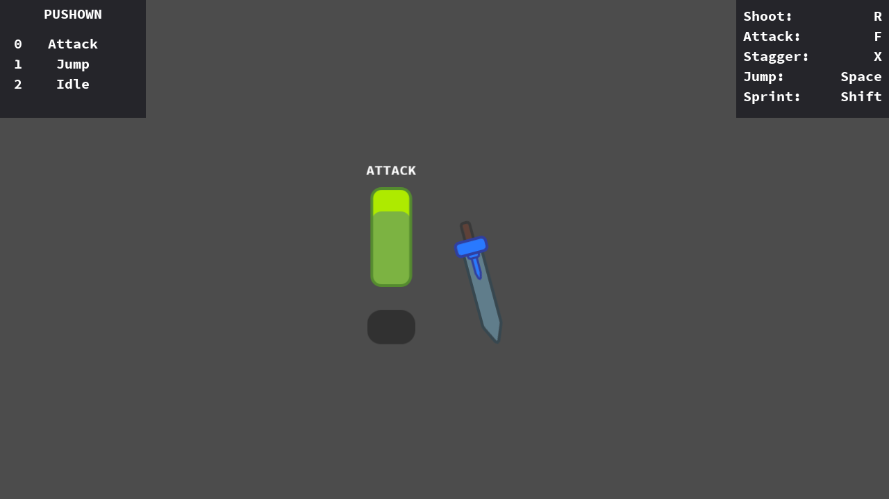

# Hierarchical Finite State Machine Modified

This is a work in progress of game that takes in advantage of a state machine

Language: GDScript

Renderer: GLES 2

## Why?

States are common and hopefully following this design pattern will make it easier to develop.

I will be using this book as resource
[Game Programming Patterns ebook](https://gameprogrammingpatterns.com/state.html).

And of course I got the intial project from 
[Godot Hierarchical Finite State Machine](https://github.com/godotengine/godot-demo-projects/tree/master/2d/finite_state_machine)

## Screenshots

